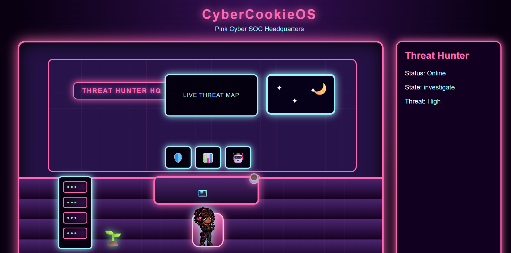
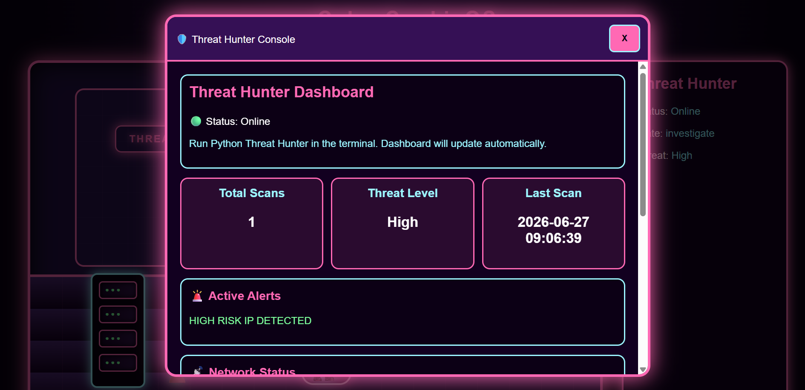
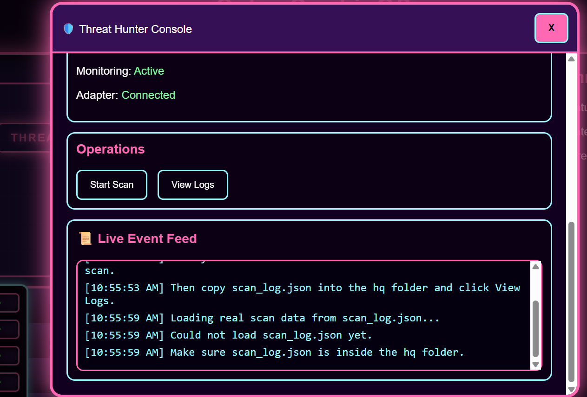

# 🩷 CyberCookieOS

CyberCookieOS is a cyber operations simulator that combines Python automation with an interactive web-based Security Operations Center (SOC).

The project is being built as my cybersecurity capstone and portfolio project. Instead of creating standalone scripts, CyberCookieOS brings multiple autonomous agents together inside a virtual headquarters where each agent performs a specific task.

---

# Current Version

**v1.0.0-alpha**

---

# How to Run

```bash
python server.py
```

This starts a local server on port 8080 and opens the dashboard automatically.
Dashboard URL: `http://localhost:8080/hq/index.html`

Press Ctrl+C to stop the server.

---

# Account Connections Setup

Account Connections lets CyberCookieOS agents connect to real external services (Google Calendar, Gmail, GitHub, etc.) using OAuth.

## Step 1 — Copy the credentials template

```bash
cp .env.example .env
```

## Step 2 — Get Google OAuth credentials (for Calendar, Gmail, Drive)

1. Go to [Google Cloud Console](https://console.cloud.google.com)
2. Create a project (or use an existing one)
3. Enable the APIs you need: Google Calendar API, Gmail API, Google Drive API
4. Go to **APIs & Services → Credentials → Create Credentials → OAuth 2.0 Client ID**
5. Choose **Desktop app** or **Web application**
6. Add these Authorized Redirect URIs:
   - `http://localhost:8080/api/auth/google_calendar/callback`
   - `http://localhost:8080/api/auth/gmail/callback`
   - `http://localhost:8080/api/auth/google_drive/callback`
7. Copy the **Client ID** and **Client Secret** into your `.env` file

## Step 3 — Start the server and connect

```bash
python server.py
```

Open: `http://localhost:8080/connections/index.html`

Click **CONNECT** on any Google service. If credentials are not yet in `.env`, you'll see a clear "credentials not configured" message explaining what to add.

## Token storage security

- Tokens are stored in `data/tokens/` (gitignored — never committed)
- Tokens are **never** sent to the browser — the frontend only receives status (connected / not_connected)
- Client secrets live only in `.env` — never in JavaScript

## Implemented vs. placeholder

| Service | Status |
|---|---|
| Google Calendar | Implemented — OAuth 2.0 flow ready (needs .env credentials) |
| Gmail | Implemented — OAuth 2.0 flow ready (needs .env credentials) |
| Google Drive | Implemented — OAuth 2.0 flow ready (needs .env credentials) |
| GitHub | Placeholder — Coming Soon |
| Etsy | Placeholder — Coming Soon |
| TikTok | Placeholder — Coming Soon |
| Housing Sources | Configured — local scraper, no auth needed |
| Finance / Budget | Configured — localStorage, no auth needed |

---

# Current Features

## 🛡️ Agent 001 – Threat Hunter

- Scan IPv4 addresses
- Determine IP type
- Generate threat scores
- Create investigation cases
- Assign investigations to Agent 001
- Generate recommendations
- Save TXT logs
- Save JSON incident database
- Search previous investigations
- Display session statistics

---

## 🏢 CyberCookieOS HQ

- Interactive cyber headquarters
- Animated Agent 001
- Live Threat Hunter dashboard
- Event feed
- Active alert system
- Automatic dashboard refresh
- Reads live JSON investigation data
- Investigation status tracking

---

# Tech Stack

## Python

- ipaddress
- json
- datetime

## Frontend

- HTML5
- CSS3
- JavaScript

## Version Control

- Git
- GitHub

---

# Project Architecture

```
Python Threat Hunter
        │
        ▼
scan_log.json
        │
        ▼
CyberCookieOS Dashboard
        │
        ▼
Agent 001
```

---

# Roadmap

## Phase 1 ✅

- Threat Hunter
- Live Dashboard
- JSON Logging
- Autonomous Agent 001
- Cyber HQ

---

## Phase 2 ✅

### Agent 002 — Apartment Hunter

Features built:

- Filter by max rent budget
- Filter by pet-friendly requirement
- Filter by housing voucher acceptance
- Filter by preferred cities
- Filter by minimum bedrooms
- Score and rank matches 0–100
- Save ranked results to JSON
- Apartment Hunter room in CyberCookieOS HQ
- HQ Hallway connecting rooms
- Live panel updates from apartment_results.json

How to run:

```bash
cd agents/apartment_hunter
python apartment_hunter.py
```

Results saved to: `data/apartment_results.json`

Apartment Hunter room: `http://localhost:8080/apartment/index.html`

HQ Hallway: `http://localhost:8080/hallway/index.html`

Sample data note:

`data/apartments.json` contains 15 sample listings for Burlington County, NJ
(Willingboro, Mount Laurel, Marlton, Southampton). These are fictional listings
for development and demo purposes. The `listing_url` field on each listing
points to a real estate search page for that city. To use real listings:
replace `listing_url` values with actual property URLs from Zillow, Realtor.com,
or Apartments.com, and update the other fields to match real listings.

Features planned:

- Live apartment scraping
- Daily update scheduler
- Save favorites
- Email alerts for new matches

---

## Phase 3

Additional autonomous agents

- Calendar Agent
- Email Agent
- Cloud Agent
- Etsy Agent
- Passive Income Agent

---

# Future Vision

CyberCookieOS will evolve into a complete personal cyber operating system where autonomous agents perform real-world tasks while reporting back to a centralized headquarters.

Examples include:

- Cybersecurity investigations
- Housing searches
- Calendar management
- Email monitoring
- Cloud monitoring
- Automation workflows

---

# 📸 Screenshots

## CyberCookieOS HQ



---

## Threat Hunter Dashboard



---

## Agent 001


---

## Python Threat Hunter


---

## Live Event Feed



---

# Installation

Clone the repository

```bash
git clone https://github.com/zgladney/cyber-cookie-os.git
```

Run the Python Threat Hunter

```bash
python threat_hunter.py
```

Open the HQ

```
hq/index.html
```

---

# Author

**Zimiah Gladney**

Cybersecurity Student

Building CyberCookieOS one autonomous agent at a time.
